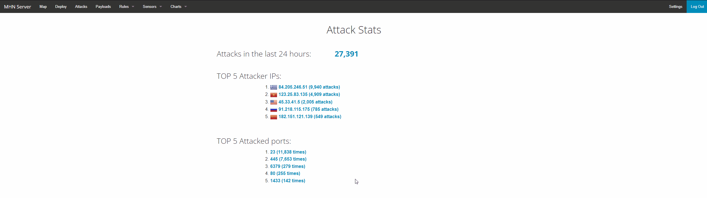

# Google Cloud Compute Honeypot using MHN-ADMIN

**Time spent:** **5** hours spent in total

### For this Honeypot, we will be using Google Cloud Compute and the Google Cloud SDK on Windows.

## MHN-Admin Deployment

**Summary:** Today, we'll be using GCP to deploy a MHN-Admin Environment for our Honeypot.

#### To start off, we'll be creating the open ports necessary to configure MHN Admin (WINDOWS GOOGLE CLOUD SDK)
`In the case that you're using Linux, replace the "^" with "^"`
```
gcloud compute firewall-rules create http ^
    --allow tcp:80 ^
    --description="Allow HTTP from Anywhere" ^
    --direction ingress ^
    --target-tags="mhn-admin"
```
```
gcloud compute firewall-rules create honeymap ^
    --allow tcp:3000 ^
    --description="Allow HoneyMap Feature from Anywhere" ^
    --direction ingress ^
    --target-tags="mhn-admin"
```
```
gcloud compute firewall-rules create hpfeeds ^
    --allow tcp:10000 ^
    --description="Allow HPFeeds from Anywhere" ^
    --direction ingress ^
    --target-tags="mhn-admin"
```

#### Next we'll run the command that setups the VM in GCP

```
gcloud compute instances create "mhn-admin" ^
    --machine-type "n1-standard-1" ^
    --subnet "default" ^
    --maintenance-policy "MIGRATE" ^
    --tags "mhn-admin" ^
    --image-family "ubuntu-minimal-1804-lts" ^
    --image-project "ubuntu-os-cloud" ^
    --boot-disk-size "10" ^
    --boot-disk-type "pd-standard" ^
    --boot-disk-device-name "mhn-admin"
```

#### After running these commands, we'll connect to our VM using SSH

```
gcloud compute ssh mhn-admin
```

#### Once we SSH into the VM, we're going to install the MHN Admin Application :)

#### First we will retrieve the latest packages using:
	sudo apt update && sudo apt install git python-magic -y
#### Second, we'll be pulling MHN from github and running the shell file (one at a time)
	cd /opt/
	
	sudo git clone https://github.com/pwnlandia/mhn.git
	
	cd mhn/
		
	sudo sed -i 's/Flask-SQLAlchemy==2.3.2/Flask-SQLAlchemy==2.5.1/g' server/requirements.txt
		
	sudo ./install.sh
		
#### After this, it'll have you create give you "Y/N" prompts. Hit N for every single prompt.

	Superuser Email: Use Any Email.
	Superuser password: Use any password of your choosing.
	
#### As stated before, hit n for the rest of the prompts. This process should take anywhere from 5-15 minutes.
#### Now you have created a mhn-admin VM and are ready to create the Honeypot :)


#### The below gif shows you how to access the MHN-Admin website console using the username and password you created.


## Dionaea Honeypot Deployment 

**Summary:** Alongside the MHN-Admin, we'll be deploying a Dionaea Honeypot. This Honeypot will collect malware and attack data through the MHN application through using all open ports.

#### Lets create a honeypot tagged firewall with all open ports

	gcloud compute firewall-rules create wideopen ^
		--description="Allow TCP and UDP from Anywhere" ^
		--direction ingress ^
		--priority=1000 ^
		--network=default ^
		--action=allow ^
		--rules=tcp,udp ^
		--source-ranges=0.0.0.0/0 ^
		--target-tags="honeypot"

#### Now let's create the first honeypot

	gcloud compute instances create "honeypot-1" ^
		--machine-type "n1-standard-1" ^
		--subnet "default" ^
		--maintenance-policy "MIGRATE" ^
		--tags "honeypot" ^
		--image-family "ubuntu-minimal-1804-lts" ^
		--image-project "ubuntu-os-cloud" ^
		--boot-disk-size "10" ^
		--boot-disk-type "pd-standard" ^
		--boot-disk-device-name "honeypot-1"

#### In order to access the newly created honeypot, you can do the same as before with SSH :)

`gcloud compute ssh honeypot-1`


#### Now we're going to install the honeypot application. 

**In order to do so, we're going to use the "Ubuntu/Raspberry Pi - Dionaea" deploy command under Deploy on your MHN Server**

##### Here is an example command:

```
wget "http://x.x.x.x/api/script/?text=true&script_id=2" -O deploy.sh && sudo bash deploy.sh http://x.x.x.x LwvoSENw
```

`x.x.x.x = The IP address of your MHN Admin VM`

#### Now that it's installed, look under the Sensors tab on your MHN-admin website. Honeypot-1 should appear




## Database Backup

**Summary:** We will export the data records from the honeypots. It stores itself in a MongoDB format in a session.json file we will create.

#### First, we will SSH back into the mhn-admin VM

`gcloud compute ssh mhn-admin`

#### Second, we will run this command to export the MongoDB information to a session.json file in our working directory

	mongoexport --db mnemosyne --collection session > session.json

#### Lastly, In order to get the session.json file on our computer, we will use SCP to transfer the file.

`gcloud compute scp mhn-admin:~/session.json ./session.json`

**IF THAT DOES NOT WORK, USE THE BELOW COMMAND**

`gcloud compute scp mhn-admin:/home/"your username"/session.json ./session.json`

#### In your Session.json file, the lines should look like this from the MongoDB

```
{"_id":{"$oid":"626f8a77616a1e65181af2e2"},"protocol":"pcap","hpfeed_id":{"$oid":"626f8a75616a1e65181af2e1"},"timestamp":{"$date":"2022-05-02T07:38:29.651Z"},"source_ip":"81.17.23.138","source_port":52835,"destination_port":81,"identifier":"c22872be-c9ea-11ec-a047-42010a8a0004","honeypot":"dionaea"}
```

#### Visual Example


## Deploying Additional Honeypots

**Summary:** Now we are going to create two additional Honeypots. This is a pretty simple process

#### To start off, we will be rerunning the commands from the original honeypot with slightly different naming.

	gcloud compute instances create "honeypot-2" ^
		--machine-type "n1-standard-1" ^
		--subnet "default" ^
		--maintenance-policy "MIGRATE" ^
		--tags "honeypot" ^
		--image-family "ubuntu-minimal-1804-lts" ^
		--image-project "ubuntu-os-cloud" ^
		--boot-disk-size "10" ^
		--boot-disk-type "pd-standard" ^
		--boot-disk-device-name "honeypot-2"
		
	gcloud compute instances create "honeypot-3" ^
		--machine-type "n1-standard-1" ^
		--subnet "default" ^
		--maintenance-policy "MIGRATE" ^
		--tags "honeypot" ^
		--image-family "ubuntu-minimal-1804-lts" ^
		--image-project "ubuntu-os-cloud" ^
		--boot-disk-size "10" ^
		--boot-disk-type "pd-standard" ^
		--boot-disk-device-name "honeypot-3"
		
#### Next, we have to ssh into each honeypot respectively

`gcloud compute ssh honeypot-2`

`gcloud compute ssh honeypot-3`
	
#### Next, we have to install the sensors once again using the wget command line for each honeypot

```
wget "http://x.x.x.x/api/script/?text=true&script_id=2" -O deploy.sh && sudo bash deploy.sh http://x.x.x.x LwvoSENw
```

`x.x.x.x = The IP address of your MHN Admin VM`
	
#### Visual Example


## Extra: Run your own NMAP Attack

#### As a side example, you can run your own nmap attacks on your honeypot
	
	nmap -A -T4 x.x.x.x
	
`x.x.x.x is the honeypot ip address listed on GCP or the MHN-ADMIN Sensor panel`

### Malware Capture and Identification (Optional)

#### X Malware

**Summary:** How did you find it? Which honeypot captured it? What does each malware do?

MD5 Hash: *Run `md5sum` on the file and record the hash here.*

SHA1 Hash: *Run `sha1sum` on the file and record the hash here.*


## Notes

Describe any challenges encountered while doing the assignment.