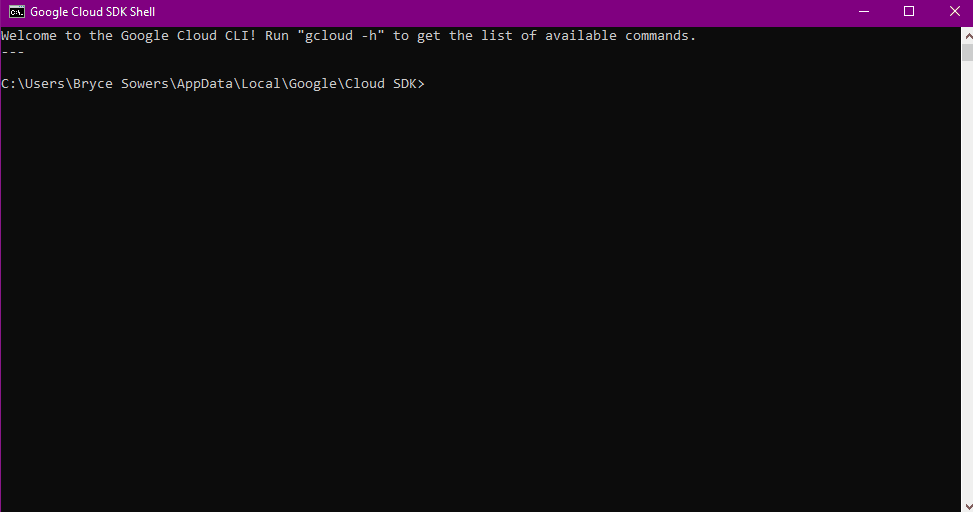
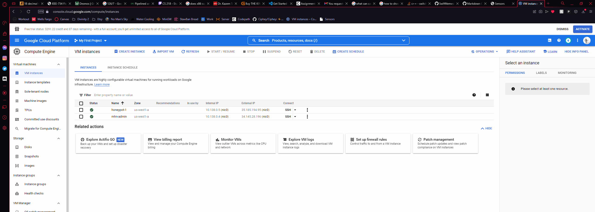
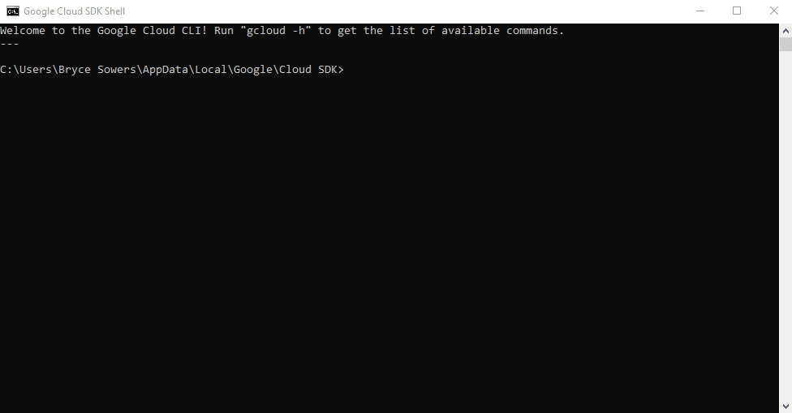

# Honeypot Assignment

**Time spent:** **5** hours spent in total

### For this Honeypot, we will be using Google Cloud Compute and the Google Cloud SDK on Windows.

### MHN-Admin Deployment

**Summary:** Today, we'll be using GCP to deploy a MHN-Admin Environment for our Honeypot.

#### To start off, we'll be creating the open ports necessary to configure MHN Admin (WINDOWS GOOGLE CLOUD SDK)
`In the case that you're using Linux, replace the "^" with "\"`
```
gcloud compute firewall-rules create http ^
    --allow tcp:80 ^
    --description="Allow HTTP from Anywhere" ^
    --direction ingress ^
    --target-tags="mhn-admin"
```
```
gcloud compute firewall-rules create honeymap ^
    --allow tcp:3000 ^
    --description="Allow HoneyMap Feature from Anywhere" ^
    --direction ingress ^
    --target-tags="mhn-admin"
```
```
gcloud compute firewall-rules create hpfeeds ^
    --allow tcp:10000 ^
    --description="Allow HPFeeds from Anywhere" ^
    --direction ingress ^
    --target-tags="mhn-admin"
```

#### Next we'll run the command that setups the VM in GCP

```
gcloud compute instances create "mhn-admin" ^
    --machine-type "n1-standard-1" ^
    --subnet "default" ^
    --maintenance-policy "MIGRATE" ^
    --tags "mhn-admin" ^
    --image-family "ubuntu-minimal-1804-lts" ^
    --image-project "ubuntu-os-cloud" ^
    --boot-disk-size "10" ^
    --boot-disk-type "pd-standard" ^
    --boot-disk-device-name "mhn-admin"
```

#### After running these commands, we'll connect to our VM using SSH

```
gcloud compute ssh mhn-admin
```

#### Once we SSH into the VM, we're going to install the MHN Admin Application :)

#### First we will retrieve the latest packages using:
	sudo apt update && sudo apt install git python-magic -y
#### Second, we'll be pulling MHN from github and running the shell file (one at a time)
	cd /opt/
	
	sudo git clone https://github.com/pwnlandia/mhn.git
	
	cd mhn/
		
	sudo sed -i 's/Flask-SQLAlchemy==2.3.2/Flask-SQLAlchemy==2.5.1/g' server/requirements.txt
		
	sudo ./install.sh
		
#### After this, it'll have you create give you "Y/N" prompts. Hit N for every single prompt.

	Superuser Email: Use Any Email.
	Superuser password: Use any password of your choosing.
	
#### As stated before, hit n for the rest of the prompts. This process should take anywhere from 5-15 minutes.
#### Now you have created a mhn-admin VM and are ready to create the Honeypot :)



### Dionaea Honeypot Deployment 

**Summary:** Alongside the MHN-Admin, we'll be deploying a Dionaea Honeypot



### Database Backup (Required) 

**Summary:** What is the RDBMS that MHN-Admin uses? What information does the exported JSON file record?

*Be sure to upload session.json directly to this GitHub repo/branch in order to get full credit.*

### Deploying Additional Honeypot(s) (Optional)

#### X Honeypot

**Summary:** What does this honeypot simulate and do for a security researcher?


### Malware Capture and Identification (Optional)

#### X Malware

**Summary:** How did you find it? Which honeypot captured it? What does each malware do?

MD5 Hash: *Run `md5sum` on the file and record the hash here.*

SHA1 Hash: *Run `sha1sum` on the file and record the hash here.*


## Notes

Describe any challenges encountered while doing the assignment.