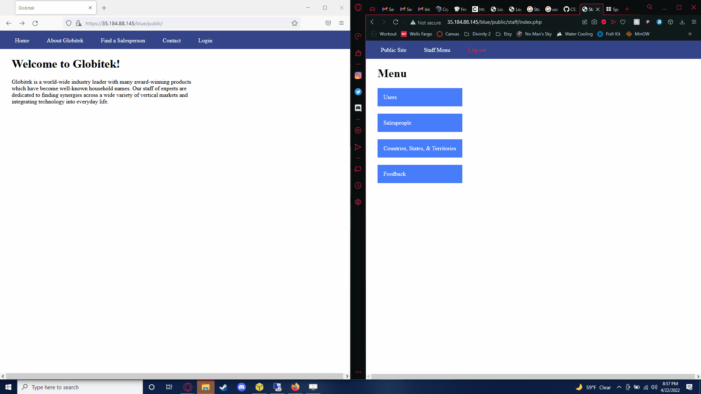
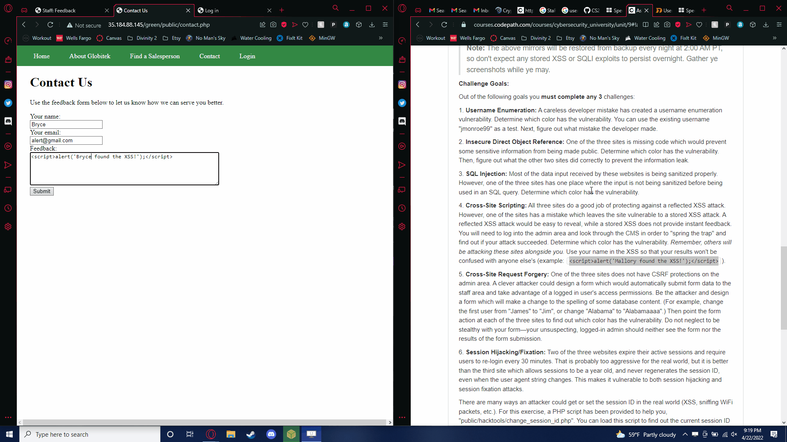
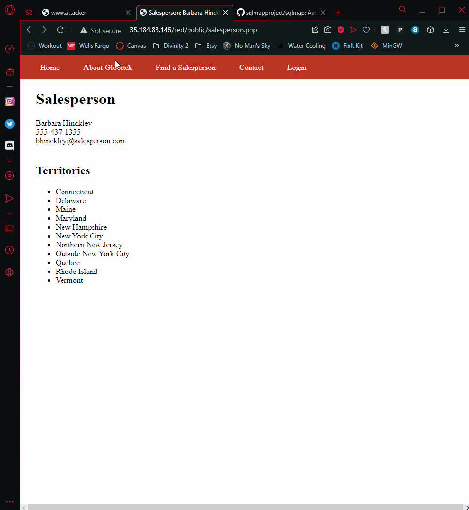

# Project 9 - Pentesting Live Targets

Time spent: **2** hours spent in total

> Objective: Identify vulnerabilities in three different versions of the Globitek website: blue, green, and red.

The six possible exploits are:

* Username Enumeration
* Insecure Direct Object Reference (IDOR)
* SQL Injection (SQLi)
* Cross-Site Scripting (XSS)
* Cross-Site Request Forgery (CSRF)
* Session Hijacking/Fixation

Each color is vulnerable to only 2 of the 6 possible exploits. First discover which color has the specific vulnerability, then write a short description of how to exploit it, and finally demonstrate it using screenshots compiled into a GIF.

## Blue

Vulnerability #1: Session Hijacking

Description: Based on the description given from codepath, we were able to use a tool
noted to be under "public/hacktools/change_session_id.php". This displays your session ID
and also allows you to change it. If you were to aquire the ID of a logged in admin as an attacker
you could change into the admin session and login again using that session ID.

## Green

Vulnerability #1: Cross Site Scripting (XSS)

Description: If not filtered correctly, websites can display and run malicious java script.
In this example, we use cross site scripting in a stored example. Whenever an admin account
runs into the stored script, it will play an alert as shown in the gif from multiple people.

## Red

Vulnerability #1: Insecure Object Reference

Description: In this example, we traverse directories in order to reveal hidden objects.
Under the **Salesperson tab** you can change an ID in the URL to change the directory file
you are looking at. If you change the ID past the maximum listed, it shows two different hidden
ones that are only available for admins.

